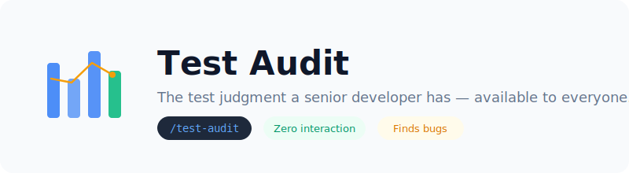
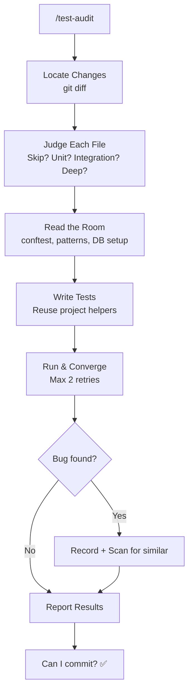

<div align="center">

<picture>
  <source media="(prefers-color-scheme: dark)" srcset="assets/banner.svg">
  
</picture>

<br/>

[](https://github.com/gtskevin/test-audit)
[]()
[]()
[]()

</div>

---

> [!NOTE]
> **Who is this for?** You build things with AI coding agents. You're not sure when code needs tests, what kind of tests, or how many. Test-audit makes those decisions for you — then writes and runs the tests.

## Highlights

| | Feature | Why it matters |
|---|---------|---------------|
| 🧠 | **Makes test decisions for you** | Reads your diff, decides which files need tests, what type, and how deep. Zero input required. |
| 🐛 | **Finds real bugs, not just coverage gaps** | Found 3 production bugs in its first project (route ordering, missing table, missing column). |
| 🔧 | **Respects your project** | Reads your conftest, reuses your helpers, follows your patterns. Never introduces new dependencies. |
| 🎯 | **Converges, doesn't retry** | 2-retry limit forces understanding over blind repetition. |

## The Gap This Fills

There are plenty of testing tools. But they all assume you already know **what to test**:

| Tool | What it does | What it assumes |
|------|-------------|-----------------|
| **TDD skills** | Enforces "write test first" process | You know WHAT to test and HOW DEEP |
| **Coverage tools** | Measures % of lines covered | You interpret the number yourself |
| **"Write tests for X"** | Generates tests for a specific file | You chose the file and scope |
| **Copilot test gen** | Suggests tests for your current file | You know which file matters |

**Test-audit is different.** It answers the question you can't: *given these code changes, what actually needs testing?*

```
A senior developer looks at your diff and thinks:
  "Type definitions? → Skip."
  "Auth routes? → High risk. Test every path."
  "Helper function? → Happy path + one edge case."
  "Database query? → Test with isolation."

Test-audit encodes this judgment.
```

## Installation

⏱️ **Get started in 30 seconds**

```bash
# Clone and install (it's a single file)
git clone https://github.com/gtskevin/test-audit.git
mkdir -p ~/.claude/skills/test-audit
cp test-audit/skill.md ~/.claude/skills/test-audit/skill.md
```

That's it. Now open Claude Code in any project and type `/test-audit`.

## Quick Start

1. Install the skill (above)
2. Open Claude Code in any project with code changes
3. Type: `/test-audit`
4. Watch the output:

```
📁 Files reviewed: 5
   → 2 files skipped (type definitions, constants)
   → 3 files need testing
🧪 Tests added: 12 (3 new test files)
✅ Result: ALL PASS
🐛 Bugs found: 1 (route ordering in analyses.py)
   → Scanned similar routes: 2 more issues found
→ Can commit? Fix the bugs first, then YES
```

## Example Prompts

Once installed, just type `/test-audit` in your agent. Here are real scenarios where it shines:

| Scenario | What to type | What happens |
|----------|-------------|-------------|
| After AI writes a feature | `/test-audit` | Scans the diff, tests only what changed |
| Before committing | `/test-audit` | Safety net — catches untested changes |
| After a big refactor | `/test-audit` | Re-evaluates which tests need updating |
| "I just don't know what to test" | `/test-audit` | Makes all test decisions for you |

> [!TIP]
> Test-audit works best right after code changes, before committing. It reads `git diff` to find exactly what changed.

## How It Works

<div align="center">



</div>

### The Judgment Engine (Core Value)

For each changed file, test-audit makes three decisions that experienced developers make instinctively:

**1. Is this file worth testing?**
```
Type definitions, constants, pure CSS     → Not worth it
Helper functions, simple data transforms   → Probably worth it
API endpoints, database operations, auth   → Definitely worth it
```

**2. What type of test?**
```
Pure logic function    → Unit test
API route with auth    → Integration test via TestClient
React component        → Test the logic, skip the rendering if deps are heavy
Database query         → Test with real DB, not mocks
```

**3. How deep?**
```
Auth/permissions/data isolation   → Every path: happy + unauthorized + edge cases
Simple helper                     → Happy path + one boundary value
Complex state machine             → State transitions table
```

These aren't hard rules — they're guidelines the AI applies with **judgment based on your actual code.**

### Bug Discovery

While writing tests, test-audit often discovers bugs in the code being tested:

| Bug Found | Root Cause | How test-audit caught it |
|-----------|-----------|------------------------|
| Route 422 on valid endpoint | Fixed path matched by `{param}` route | Test got unexpected 422 → investigated route ordering |
| `no such table` | Table only in migration, not schema init | Test DB creation failed → checked `_ensure_schema` |
| `no such column` | Column not in schema init | Test assertion failed → checked `_ensure_table_columns` |

When one bug is found, it scans for similar issues (one discovery, batch investigation).

### The 2-Retry Rule

```
1st failure → Read error, locate cause, fix
2nd failure → STOP. Re-understand the problem.
              Test infrastructure misunderstood? → Re-read conftest
              Production code has a bug?         → Record it, move on
```

**Same error twice = your mental model is wrong** — not that you need another try.

## Who Uses This

**The vibe coder** — You build with AI agents but aren't a professional developer. You don't have the "test intuition" that comes from years of shipping. Test-audit gives you that intuition.

**The solo developer shipping fast** — You know testing matters but don't have time to think about coverage strategy. Run `/test-audit` before each commit as a safety net.

**The team lead reviewing PRs** — Use test-audit to quickly assess whether a PR has adequate test coverage without reading every line.

## How It's Different

### vs. TDD Skills

TDD says "write the test first." But **which test?** Testing an auth route needs per-path coverage. Testing a helper function needs one happy path. How do you know? Experience.

Test-audit **has that experience built in.** It reads the code and makes the judgment call — so you don't need years of practice to know what "good testing" looks like.

### vs. "Write tests for X"

When you say "write tests for auth.py," you've already made the decision that auth.py needs tests. But what if the real risk is in a helper that auth.py calls? Or what if auth.py already has great coverage, but a new migration file broke the schema?

Test-audit scans **your entire diff**, not just one file you pointed at.

### vs. Coverage Reports

Coverage says "87% of lines are executed." It doesn't tell you:
- Whether the 13% gap matters
- Whether the 87% tests are actually asserting anything meaningful
- Whether a file with 100% coverage is testing the right things

Test-audit makes **qualitative** judgments, not just quantitative.

## Cross-Agent Compatibility

While designed for Claude Code, the skill's instructions are agent-agnostic:

| Agent | How to Use |
|-------|-----------|
| **Claude Code** | `mkdir -p ~/.claude/skills/test-audit && cp skill.md ~/.claude/skills/test-audit/skill.md` |
| **Codex** | Copy skill content into `AGENTS.md` as a workflow instruction |
| **Gemini CLI** | Copy into `GEMINI.md` as an available skill definition |
| **Cursor / Windsurf** | Copy into `.cursorrules` or `.windsurfrules` |

## Real Results

From 7 rounds of test-audit on a production FastAPI + React project:

| Metric | Result |
|--------|--------|
| Files correctly skipped | 3 (type definitions, CSS, constants) |
| New tests added | 35 across 3 test files |
| Production bugs found | 3 (route ordering, missing table, missing column) |
| False positives | 0 — every finding was a real issue |

## FAQ

<details>
<summary>I'm a senior developer. Do I need this?</summary>

Maybe not for judgment — you already know what to test. But you might still find value in: (1) the automated diff scanning, (2) bug discovery during test writing, and (3) the convergence discipline that prevents AI agents from infinite retry loops.
</details>

<details>
<summary>Does it work with my test framework?</summary>

Yes. Test-audit reads your existing test files and conftest to understand your framework (pytest, vitest, jest, Go testing, etc.) before writing any tests. It adapts to whatever you're using.
</details>

<details>
<summary>What if my project has no tests at all?</summary>

Test-audit will automatically set up the test infrastructure — install dependencies, create configuration, and verify the environment — before writing the first test. No manual setup needed.
</details>

<details>
<summary>How is this different from Copilot's "generate tests"?</summary>

Copilot generates tests for the file you have open. You chose the file. You decided it needs tests. Test-audit scans your entire diff, decides which files matter, and determines the right depth — then writes the tests. It's the difference between having a typist and having a test architect.
</details>

<details>
<summary>Can I use it with non-Python projects?</summary>

Yes. The judgment engine (is it worth testing, what type, how deep) is language-agnostic. The workflow adapts to any test framework.
</details>

<details>
<summary>What if the AI agent keeps retrying failing tests?</summary>

Test-audit enforces a strict 2-retry limit. After two failures on the same test, it stops and re-evaluates the root cause — either the test infrastructure was misunderstood, or the production code has a bug. No infinite loops.
</details>

## Contributing

Contributions welcome! See [CONTRIBUTING.md](CONTRIBUTING.md) for guidelines.

## Star History

[](https://star-history.com/#gtskevin/test-audit&Date)

---

<div align="center">
<sub>Built with 🧪 by <a href="https://github.com/gtskevin">@gtskevin</a> — Test judgment for everyone.</sub>
</div>
